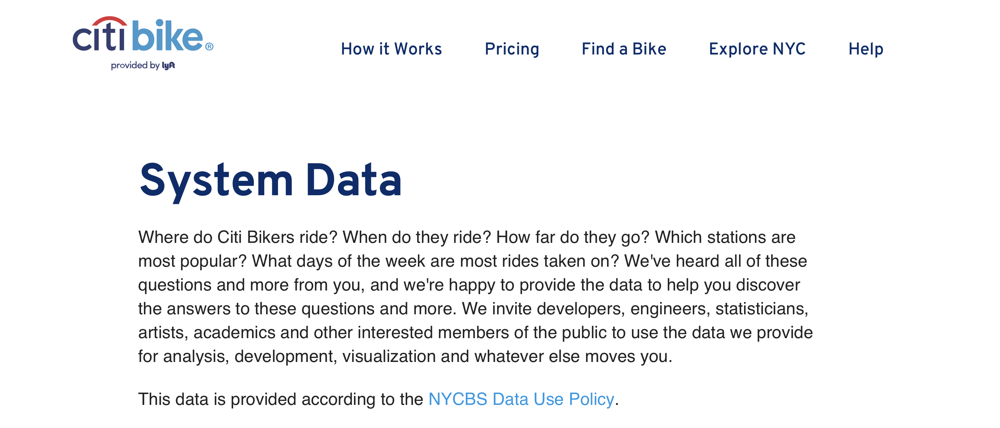

# Tableau Analytics - Citi Bike Analytics: the Quarter 2 in 2019 vs 2020 
Using Tableau, to aggregate the data found in the Citi Bike Trip History Logs in the Q2 in 2019 vs 2020 and to design visualizations for each discovered phenomenon, in order to see what changes in Citi Bike usage have occurred in 2020 which might have been induced by COVID-19.

## Background & Data Sources

Since 2013, the Citi Bike Program has implemented a robust infrastructure for collecting data on the program's utilization. Through the team's efforts, each month bike data is collected, organized, regularly updated, and made public on the [Citi Bike Data](https://www.citibikenyc.com/system-data) webpage.

Citi Bike publish [downloadable files of Citi Bike trip data](https://s3.amazonaws.com/tripdata/index.html). The data includes:
`Trip Duration (seconds)`, `Start Time and Date`, `Stop Time and Date`, `Start Station Name`, `End Station Name`, `Station ID`, `Station Lat/Long`, `Bike ID`, `User Type (Customer = 24-hour pass or 3-day pass user; Subscriber = Annual Member)`, `Gender (Zero=unknown; 1=male; 2=female)`, `Year of Birth`.

## Tasks
Choose any time span with available data (here choosing the Quarter 2 in 2019 & 2020),
* to **aggregate the data** found in the Citi Bike Trip History Logs. Note: 
	- Don't just assume Tableau is the best tool for the job.
	- The CSV format might have changed since 2013.
	- Test and develop with a smaller testing data. 
	- Keep a close eye for obvious outliers or false data. Not everyone who signs up for the program is answering honestly.
	- In answering the question of "why" a phenomenon is occurring, consider adding other pieces of information on socioeconomic or other geographic data. Tableau has a map "layer" feature that you may find handy.
	- Pay attention to labels. What exactly is "time duration"? What's the value of "year of birth"? The calculated fields are almost certainly needed.
* to design 2-5 **visualizations** for each discovered phenomena (4-10+ total)
* to include a **map** of one of the following visualizations:
	* A static map that plots all bike stations with a visual indication of the most popular locations to start and end a journey with zip code data overlaid on top.
	* A dynamic map that shows how each station's popularity changes over time (by month and year). Again, with zip code data overlaid on the map.
* to use the visualizations to design a **dashboard** for each phenomenon, while the dashboards should be accompanied with an analysis explaining why the phenomena may be occurring.
* to create a **Tableau story** that brings together the visualizations, requested maps, and dashboards. 
	- This is the final presentation, and make sure the presentation is general-public-friendly, professional, and visually compelling. So, spend the appropriate time thinking through decisions on colour schemes, fonts, and visual story-telling. 
	- The Citi Bike program has a clear visual footprint. As a suggestion, look for ways to have the data visualizations match their aesthetic tones.

## Objectives
The questions of interest include: 
* How many trips have been recorded total during the chosen period?
* By what percentage has total ridership grown?
* How has the proportion of short-term customers and annual subscribers changed?
* What are the peak hours in which bikes are used during summer months?
* What are the peak hours in which bikes are used during winter months?
* Today, what are the top 10 stations in the city for starting a journey? (Based on data, why do you hypothesize these are the top locations?)
* Today, what are the top 10 stations in the city for ending a journey? (Based on data, why?)
* Today, what are the bottom 10 stations in the city for starting a journey? (Based on data, why?)
* Today, what are the bottom 10 stations in the city for ending a journey (Based on data, why?)
* Today, what is the gender breakdown of active participants (Male v. Female)?
* How effective has gender outreach been in increasing female ridership over the timespan?
* How does the average trip duration change by age?
* What is the average distance in miles that a bike is ridden?
* Which bikes (by ID) are most likely due for repair or inspection in the timespan?
* How variable is the utilization by bike ID?

- - -

## Navigation of the repo: Submission

The Tableau workbook includes: 
  * 12 Visualizations 
  * 4 Dashboards
  * 2 City Official Map
  * 1 Story 
  * A text or markdown file with the analysis on the phenomenons uncovered from the data.
  
The published Tableau workbook in the Tableau Public profile is [here](https://public.tableau.com/profile/qianyue.ma#!/vizhome/citibike_analytics_16048902264600/CompeleAnalysis).

